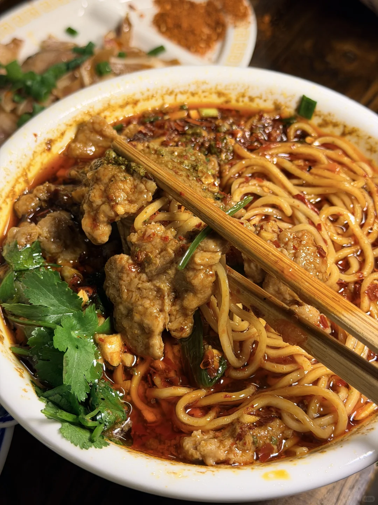
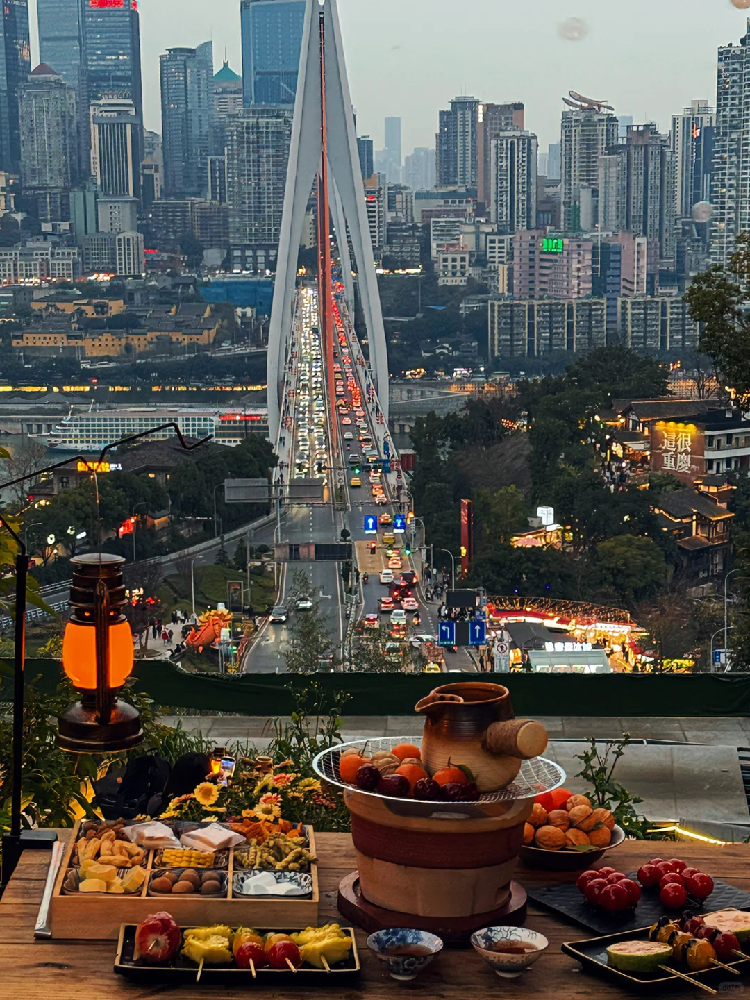
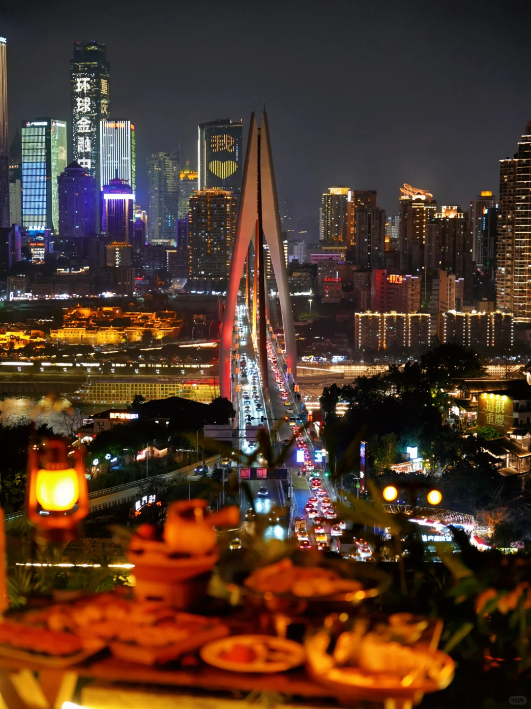
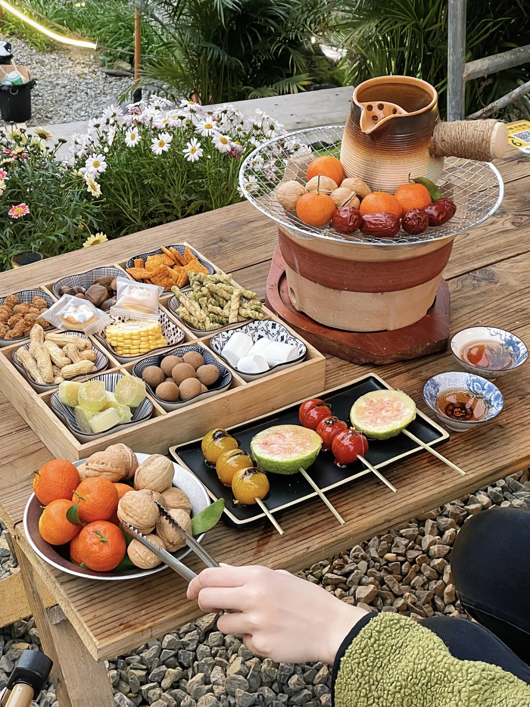
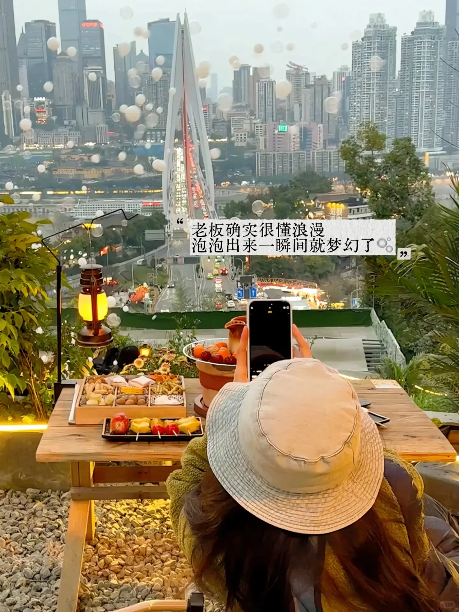
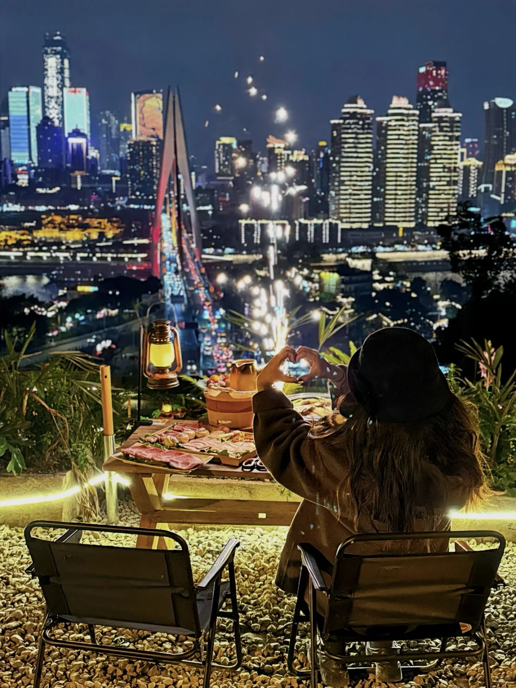
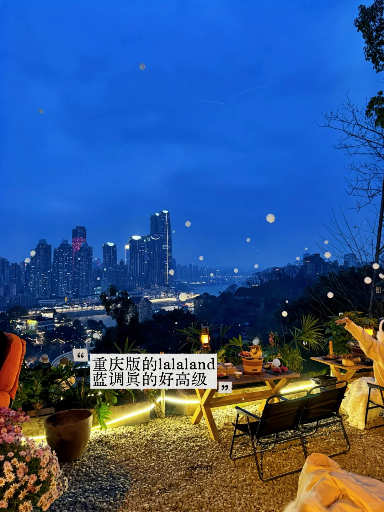

# 重庆2天旅游攻略

> 数据来源：小红书高赞帖子，按路线+美食+拍照结构整理
> 图片严格对应帖子内容，不张冠李戴

---

## Day 1：上新街 → 长嘉汇路线

### 📍 地图路线

**总路线：上新街 → 社会主义学院 → 龙门浩老街 → 下浩里 → 南滨路钟楼 → 长嘉汇购物广场**

> 来源帖：往返重庆N次，还是最爱南滨路（附路线）| 👍 3467赞 | ⭐ 4128收藏

**① 上新街地铁站 → 社会主义学院**

- 🚶 步行约10分钟
- 📝 上新街地铁站出发，沿南滨路方向走，社会主义学院进大门走左边到尽头，俯瞰城市全景超好拍

---

**② 社会主义学院 → 龙门浩老街**

- 🚶 步行约8分钟
- 📝 "半山草堂茶舍"外用长焦拍长江索道，"既下山"旁边也好拍。老街有吊脚楼、茶馆，逛起来很有味道

---

**③ 龙门浩老街 → 下浩里**

- 🚶 步行约5分钟
- 📝 穿过"浩阅书店"到最佳观景点，"雾都周末"旁边也出片。下浩里是文艺青石板老街，白天市井烟火，晚上8D夜景

---

**④ 下浩里 → 南滨路钟楼 → 长嘉汇购物广场**

- 🚶 步行约15分钟
- 📝 钟楼对面拍照，"重庆之圆"在呼归石公交站对面。长嘉汇周六有无人机表演，提前半小时占位

---

### 🍜 美食推荐

> 只推荐有小红书帖子实拍图佐证的美食，图片来自对应帖子

**① 福禄牛肉面** | 👍 759赞

- 📍 下浩里老街内（店不大不好找，附指路图见小红书原帖）
- 💰 人均：20-30元
- 🍽️ 推荐菜：水煮牛肉面、番茄牛肉杂酱面、卤猪耳朵、黄皮茶、翡翠豆花
- 📝 评价：水煮牛肉面肉质嫩而不柴，热油现泼又麻又辣又过瘾！番茄杂酱面每根面条裹满酱汁。卤猪耳朵脆爽弹牙，蘸辣椒面安逸。黄皮茶果肉香浓清爽开胃。翡翠豆花上面绿色是开心果酱。人均二三十性价比超高，唯一缺点是店小不好找

---

**② 下浩里山景烤肉** | 👍 899赞

- 📍 下浩里老街，270度观景位
- 💰 人均：80-120元
- 🍽️ 推荐菜：招牌烤肉、烤五花肉、烤牛舌、啤酒
- 📝 评价：270度一览无余的绝佳观景视角，重庆江景/夜景/灯光秀都能看到。晚上还有打铁花/电子烟花/放孔明灯活动，氛围感拉满。人少景美，比洪崖洞舒服太多。从上新街地铁站4号口出来几百米就到，可以下午一直坐到晚上

---

**③ 其他沿途美食（无实拍图，仅文字推荐）**

| 店名 | 位置 | 人均 | 推荐菜 | 评价 |
|------|------|------|--------|------|
| 梯坎老灶火锅 | 龙门浩老街周边 | 80-100元 | 九宫格牛油锅底、毛肚、鸭肠 | 老重庆味道，锅底浓郁，吊脚楼风格 |
| 既下山酒店咖啡 | 龙门浩·即下山酒店内 | 40-60元 | 手冲咖啡、提拉米苏 | 景观位看江景，适合歇脚，拍照出片 |
| 浩阅书店茶饮 | 下浩里·浩阅书店内 | 30元 | 水果茶、桂花乌龙 | 文艺氛围，穿过书店到最佳观景点 |
| 南滨路江边烧烤 | 南滨路钟楼附近江边 | 60-80元 | 烤脑花、烤串、烤鱼 | 江边吹风吃烧烤，晚上去更合适 |
| 长嘉汇餐饮 | 长嘉汇购物广场内 | 50-150元 | 火锅、江湖菜、甜品 | 逛完直接吃，傍晚去吃完看夜景 |

**沿途小吃：**

| 小吃 | 价格 | 位置 | 评价 |
|------|------|------|------|
| 🧊 冰粉凉虾 | 8-12元 | 下浩里入口处 | 解辣神器，夏天必喝 |
| 🌶️ 烤脑花 | 15-25元 | 龙门浩老街路边摊 | 重庆特色，入口即化 |
| 🍡 陈麻花 | 10-20元/袋 | 龙门浩老街 | 酥脆香甜，可当伴手礼 |
| 🍢 酸辣粉 | 12-18元 | 上新街地铁站出口 | Q弹红薯粉，麻辣鲜香 |

---

### 📸 拍照打卡点（人像出片）

> 来源帖1：往返重庆N次，还是最爱南滨路 | 👍 3467赞（机位P1-P18）
> 来源帖2：为了这18张照片，我特意飞了一趟重庆 | 👍 2.4万赞
> 来源帖3：重庆私藏路线‼️南滨路Citywalk机位 | 👍 2781赞

**① 下浩里夜景**

- 📍 上新街地铁站1号出口
- 📷 夜景人像，灯笼+老街背景超出片，蓝调时间拍最佳
- 💡 tips：穿过"浩阅书店"到最佳观景点，"雾都周末"旁边也出片

---

**② "重庆之圆"**

- 📍 南滨路钟楼广场呼归石公交站对面
- 📷 利用圆形装置拍到来福士，35mm焦段
- 💡 tips：下午逆光，建议上午去顺光拍；周末圆形装置要排队

---

**③ 呼归石花阶花园**

- 📍 钟楼广场往上几十米到八角亭
- 📷 蓝调时间拍很出片，花园阶梯+江景背景
- 💡 tips：记得带驱蚊水！傍晚去光线最好

---

**④ 龙门浩老街·山城画框**

- 📍 即下山酒店门口
- 📷 框架构图拍人像，超有氛围感
- 💡 tips："半山草堂茶舍"外面用长焦拍长江索道

---

**⑤ 社会主义学院**

- 📍 进大门走左边到尽头
- 📷 俯瞰城市全景，人像+城市背景
- 💡 tips：日落时分拍剪影效果绝了

---

**⑥ 开埠遗址公园**

- 📍 南滨路沿线
- 📷 长焦拍东水门大桥，透过竹编拍长江索道
- 💡 tips：夜景更出片，法国水师兵营也在旁边可以一起拍

---

## Day 2：博物馆 + 解放碑路线

### 📍 地图路线

**总路线：重庆中国三峡博物馆 → 人民大礼堂 → 解放碑 → 国泰艺术中心 → 八一路好吃街**

> 来源帖：重庆解放碑citywalk一日游💛打卡放松版 | 👍 1785赞 | ⭐ 1271收藏

**① 三峡博物馆**

- 🚶 起点，建议2-3小时
- 📝 免费，了解重庆历史必去，提前在公众号预约。馆内有4层，重点看《壮丽三峡》和《远古巴渝》展厅

---

**② 人民大礼堂**

- 🚶 博物馆对面，步行3分钟
- 📝 外观拍照即可，仿古建筑气势恢宏，正面广场拍全景最佳

---

**③ 解放碑 → 国泰艺术中心**

- 🚶 步行/轻轨约10分钟
- 📝 解放碑打卡拍照，国泰艺术中心红墙建筑赛博朋克风超好拍

---

**④ 八一路好吃街**

- 🚶 解放碑旁边，步行3分钟
- 📝 吃货天堂，酸辣粉、抄手、串串、烤脑花一条龙

---

### 🍜 美食推荐

> Day2美食帖子详情被小红书限制访问，以下为搜索结果+路线帖图片

**① 好又来酸辣粉**

- 📍 解放碑八一路
- 💰 人均：15元
- 🍽️ 推荐菜：酸辣粉、杂酱酸辣粉、凉拌酸辣粉
- 📝 评价：解放碑老店，Q弹红薯粉+麻辣汤底，酸辣开胃。排队但值得，10分钟出餐。口味偏重，辣度中上，不能吃辣慎入

---

**② 其他解放碑美食（无实拍图，仅文字推荐）**

| 店名 | 位置 | 人均 | 推荐菜 | 评价 |
|------|------|------|--------|------|
| 吴抄手 | 解放碑附近 | 25元 | 红油抄手、清汤抄手 | 皮薄馅嫩，红油味绝，老字号 |
| 山城小汤圆 | 解放碑八一路 | 12元 | 芝麻汤圆、醪糟汤圆 | 甜而不腻，解辣解乏 |
| 降龙爪爪 | 八一路好吃街 | 20元 | 卤鸡爪、麻辣鸡爪 | 软糯入味，一抿脱骨 |
| 串串香 | 八一路好吃街 | 50-70元 | 牛肉串、毛肚、鹌鹑蛋 | 自选自煮，种类丰富 |

**沿途小吃：**

| 小吃 | 价格 | 位置 | 评价 |
|------|------|------|------|
| 🧊 冰粉 | 8-12元 | 解放碑地下通道 | 解辣必备 |
| 🌶️ 烤脑花 | 15-25元 | 八一路路边摊 | 入口即化，麻辣鲜香 |
| 🍢 凉面 | 8-15元 | 好吃街各摊位 | 麻辣爽口，夏天标配 |
| 🍜 杂酱面 | 12-18元 | 好又来（八一路） | 麻辣鲜香，早餐灵魂 |

---

### 📸 拍照打卡点（人像出片）

> 来源帖1：解放碑拍照攻略｜3个角度，朋友圈赞爆不重样 | 👍 648赞
> 来源帖2：为了这18张照片，我特意飞了一趟重庆 | 👍 2.4万赞

**① 解放碑碑下仰拍**

- 📍 解放碑步行街中心
- 📷 广角仰拍，三件套秒变长腿女神
- 💡 tips：人很多，建议早上8-9点去拍

---

**② 国泰艺术中心**

- 📍 解放碑旁边
- 📷 红墙+赛博朋克风，人像超有冲击力
- 💡 tips：穿黑色或白色衣服最出片，红墙做背景对比强烈

---

**③ 复星国际4楼**

- 📍 解放碑复星国际中心4楼
- 📷 古今同框，现代建筑+老重庆
- 💡 tips：坐电梯到4楼露台，免费

---

**④ 颠倒世界**

- 📍 解放碑民俗文化馆
- 📷 创意构图，朋友圈话题感十足
- 💡 tips：手机倒过来拍，后期旋转180度

---

**⑤ "彩虹天梯"**

- 📍 枇杷山正街公交站对面天台
- 📷 彩色阶梯+人像，日系风出片
- 💡 tips：下午顺光拍最好，穿浅色衣服

---

## 💡 实用Tips

1. 导航在重庆基本失灵，立体城市请多问路人
2. 穿舒适的平底鞋，爬坡上坎是日常
3. D1路线顺序建议：上新街→长嘉汇，全程下坡为主不累
4. 周六长嘉汇无人机表演很值得，提前半小时占位
5. 解放碑周边美食不用刻意找，八一路好吃街一条龙
6. 饮食偏辣，不能吃辣提前说"微辣"或"鸳鸯锅"
7. 博物馆免费但需预约，建议提前在公众号预约
